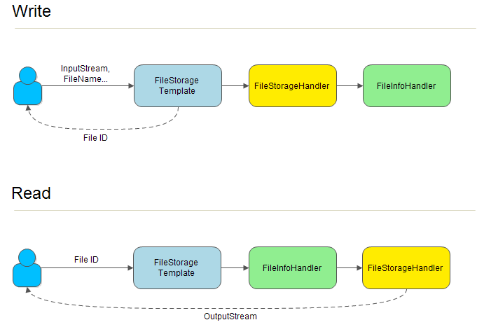

## File Storage
- The tools of file storage
- Supports Spring Boot
- Generate union identify for file
- Customized FileInfoHandler
- Customized FileStorageHandler

### Main Frame


### Read And Write



> Setup FileInfoHandler:
> - To save file information, we need to setup a custom FileInfoHandler.

### Example
```yaml
  fs:
    file-storage:
      default-type: swift-c2
      types:
        swift:
          path: http://1.2.3.4:8080/v1/dev_xxx/file
        swift-temp:
          path: http://1.2.3.4:8080/v1/dev_xxx/tmp
        swift-c2:
          path: http://1.2.3.4:8080/v1/dev_xxx/file
        swift-c2-temp:
          path: http://1.2.3.4:8080/v1/dev_xxx/tmp
        fast-dfs:
          type: fdfs
          path: group1
        sftp-cdn:
          type: sftp
          path: 1.2.3.5:22/home/appuser/test
          username: abc
          password: xxx
        sftp-cdn2:
          type: sftp
          path: 1.2.3.6:22/home/appuser/test
          username: abc
          password: xxx
        sftp-cdn-group:
          type: group
          path: sftp-cdn,sftp-cdn2
```

```java
    @Autowired
    private FileStorageTemplate fileStorageTemplate;

    // save
    FileInfo fileInfo = new FileInfo();
    //fileInfo.setStorageType("fast-dfs");
    fileInfo.setFileCode("test1");
    fileInfo = fileStorageTemplate.storageFile(new File("/test.png"), fileInfo);
    System.out.println(fileInfo.getId() + ": " + fileInfo.getFilePath());
    
    // get file info
    String fileId = "43e58f9a42b34e0fbed4ccc259418a72";
    FileInfo fileInfo = fileStorageTemplate.getFileInfo(fileId);
    
    // get file
    String fileId = "43e58f9a42b34e0fbed4ccc259418a72";
    try (OutputStream out = new FileOutputStream("/temp/test.png")) {
        fileStorageTemplate.getFile(fileId, out);
    }
    
    // delete
    String fileId = "43e58f9a42b34e0fbed4ccc259418a72";
    fileStorageTemplate.deleteFile(fileId);
```

## File Upload
- File upload tools for Spring MVC
- Supports Spring Boot
- Customized type configuration

### Example
```yaml
  fs:
    file-upload:
      types:
        default:
          max-size: 50m
        test1:
          #storage-kind: 1
          #storageType: fast-dfs
          max-size: 10m
          suffix: xls,xlsx
```

```java
    @Autowired
    private FileUploadTemplate fileUploadTemplate;

    // get upload config
    FileUploadConfig config = fileUploadTemplate.getUploadConfig("test1");

    // upload
    FileUploadResult result = fileUploadTemplate.uploadFile("user1", "test1", multipartFile);
```