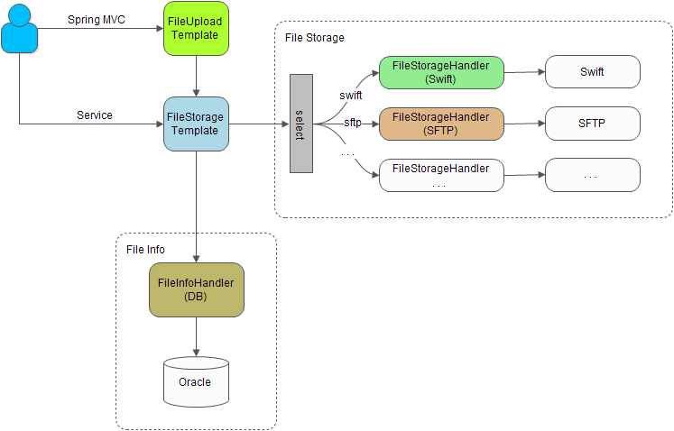

## 文件存储
- 文件存储工具，支持文件的上传、下载、删除操作
- 支持spring autoconfig，配置参数即可使用
- 为文件生成唯一ID，通过唯一ID获取文件
- 定制化文件信息处理器（FileInfoHandler），能够存储文件信息（如：文件名、类型、创建时间等）
- 定制化文件存储处理器（FileStorageHandler），默认为swift存储，目前支持的有swift、fdfs、sftp、group

### 总体框架


### 读写流程


> 文件存储需要保存文件信息，需指定FileInfoHandler：
> - 需自定义FileInfoHandler，注入Spring容器

### 例子
```yaml
    file-storage:
      default-type: swift-c2
      types:
        swift:
          path: http://1.2.3.4:8080/v1/dev_xxx/file
        swift-temp:
          path: http://1.2.3.4:8080/v1/dev_xxx/tmp
        swift-c2:
          path: http://1.2.3.4:8080/v1/dev_xxx/file
        swift-c2-temp:
          path: http://1.2.3.4:8080/v1/dev_xxx/tmp
        fast-dfs:
          type: fdfs
          path: group1
        sftp-cdn:
          type: sftp
          path: 1.2.3.5:22/home/appuser/test
          username: abc
          password: xxx
        sftp-cdn2:
          type: sftp
          path: 1.2.3.6:22/home/appuser/test
          username: abc
          password: xxx
        sftp-cdn-group:
          type: group
          path: sftp-cdn,sftp-cdn2
```

```java
    @Autowired
    private FileStorageTemplate fileStorageTemplate;

    //保存
    FileInfo fileInfo = new FileInfo();
    //fileInfo.setStorageType("fast-dfs");
    fileInfo.setFileCode("test1");
    fileInfo = fileStorageTemplate.storageFile(new File("/test.png"), fileInfo);
    System.out.println(fileInfo.getId() + ": " + fileInfo.getFilePath());
    
    //获取文件信息
    String fileId = "43e58f9a42b34e0fbed4ccc259418a72";
    FileInfo fileInfo = fileStorageTemplate.getFileInfo(fileId);
    
    //获取文件
    String fileId = "43e58f9a42b34e0fbed4ccc259418a72";
    try (OutputStream out = new FileOutputStream("/temp/test.png")) {
        fileStorageTemplate.getFile(fileId, out);
    }
    
    //删除
    String fileId = "43e58f9a42b34e0fbed4ccc259418a72";
    fileStorageTemplate.deleteFile(fileId);
```

## 文件上传
- 文件上传工具，支持spring mvc的文件上传
- 支持spring autoconfig，配置参数即可使用
- 支持定义类型，不同类型可使用不同配置，支持缺省配置

例子：
```yaml
youcash:
  k2:
    upload:
      types:
        default:
          max-size: 50m
        test1:
          #storage-kind: 1
          #storageType: fast-dfs
          max-size: 10m
          suffix: xls,xlsx
```

```java
    @Autowired
    private FileUploadTemplate fileUploadTemplate;

    //获取上传配置
    FileUploadConfig config = fileUploadTemplate.getUploadConfig("test1");

    //上传
    FileUploadResult result = fileUploadTemplate.uploadFile("user1", "test1", multipartFile);
```